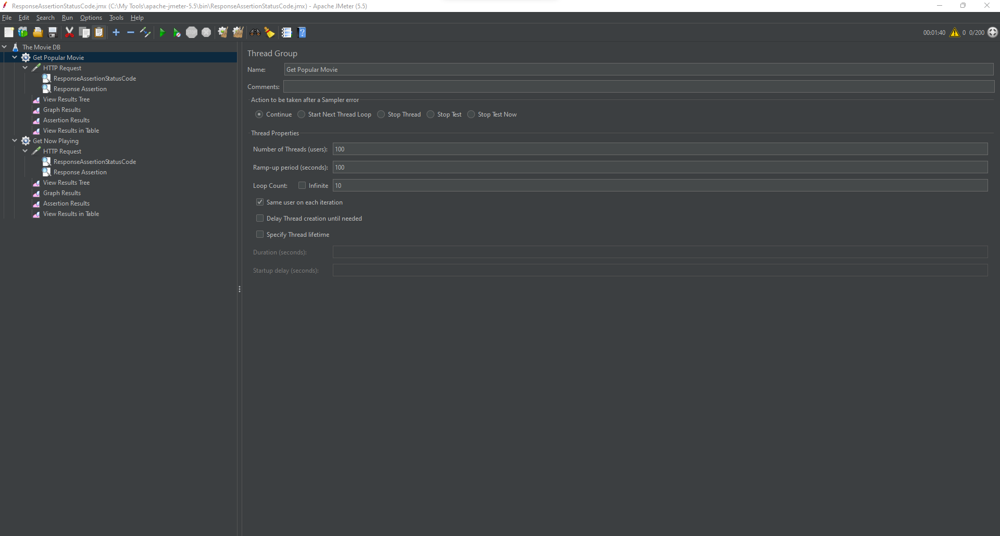
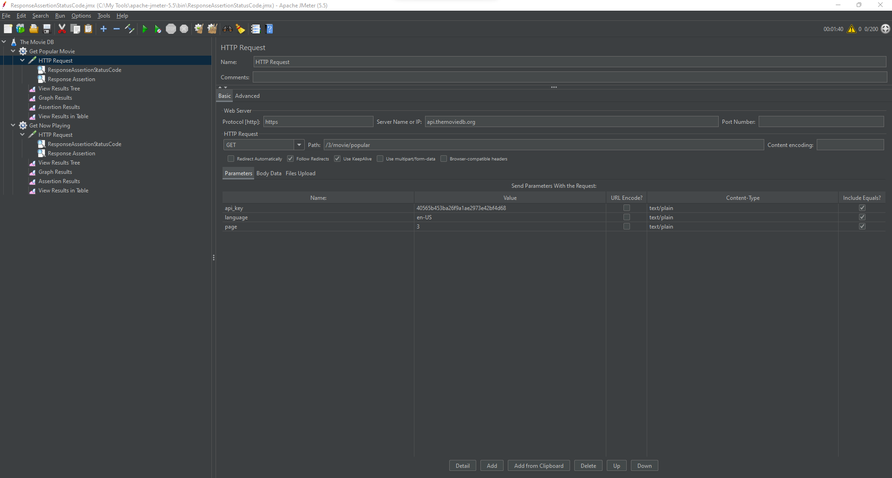
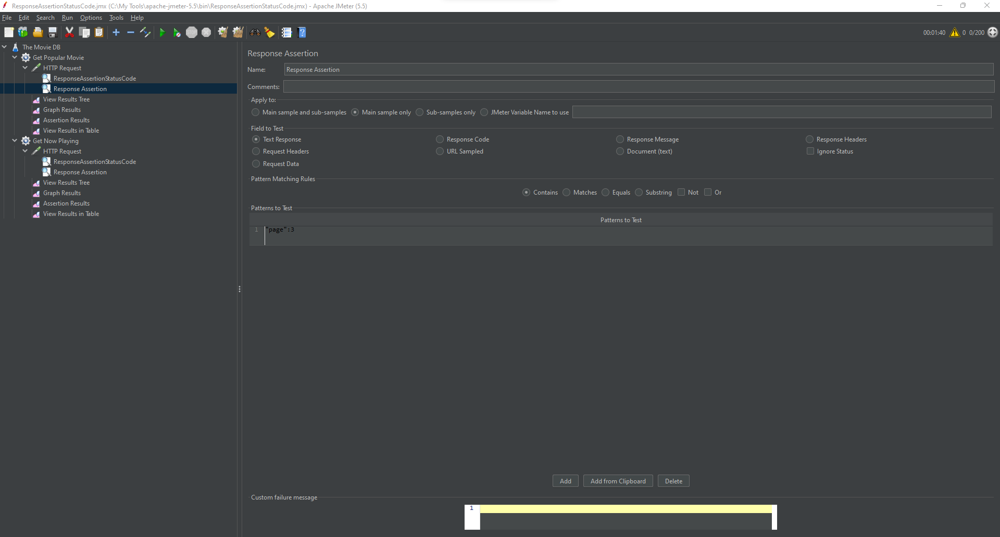
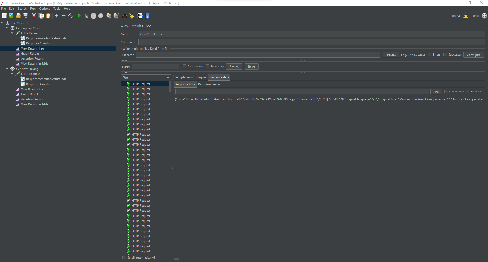
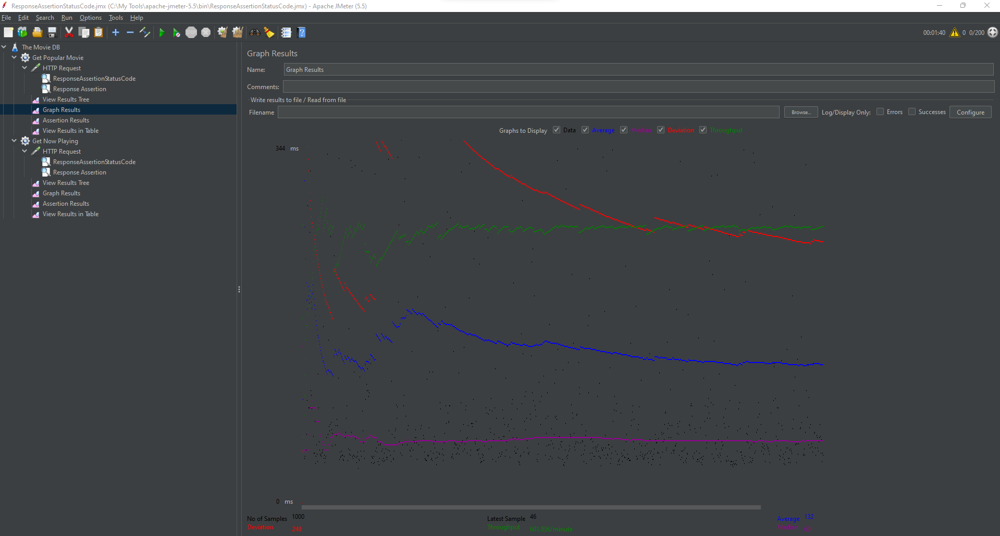
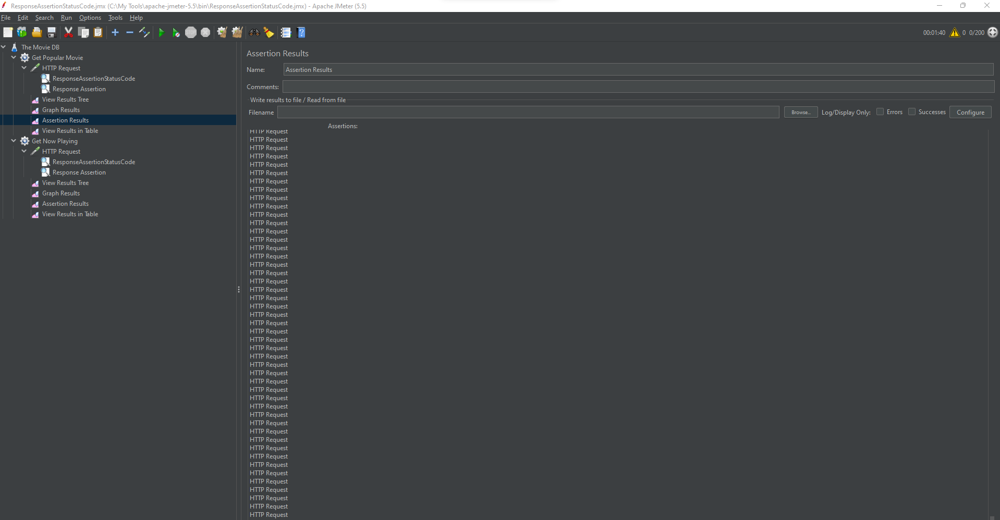
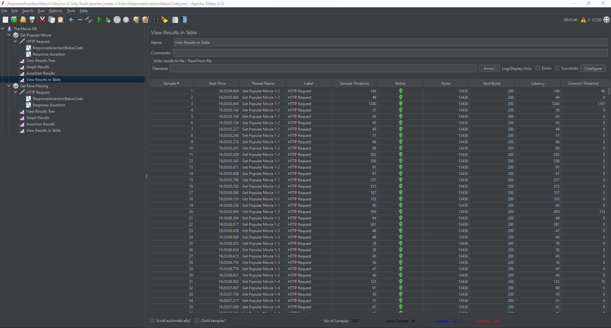

## JuaraCoding Manual Testing API Post Test 27

### Get Popular Movie

### Get Popular Movie HTTP Request

### Get Popular Movie ResponseAssertionStatusCode

### Get Popular Movie Response Assertion

### Get Popular Movie View Results Tree

### Get Popular Movie Graph Results

### Get Popular Movie Assertion Results

### Get Popular Movie View Results in Table

### Get Now Playing Movie

### Get Now Playing HTTP Request

### Get Now Playing ResponseAssertionStatusCode

### Get Now Playing Response Assertion

### Get Now Playing View Results Tree

### Get Now Playing Graph Results

### Get Now Playing Assertion Results

### Get Now Playing View Results in Table

